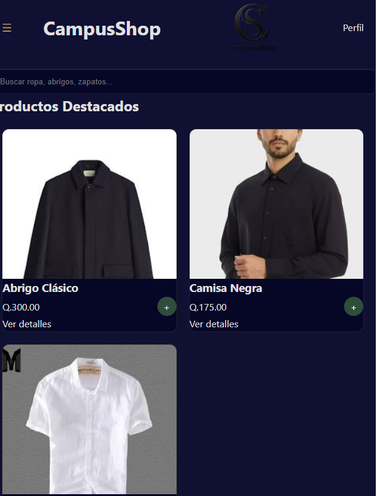
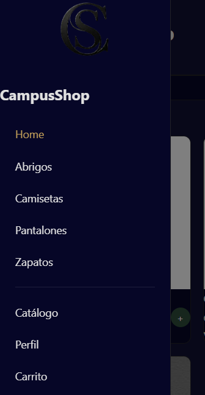
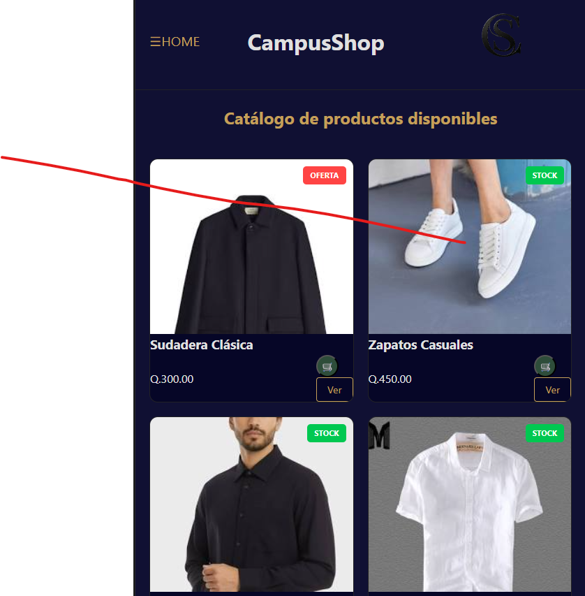
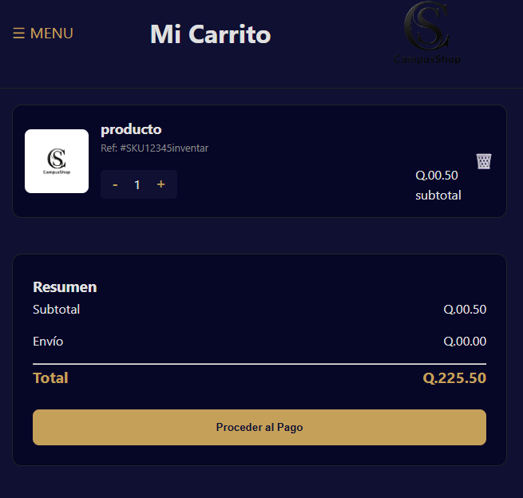
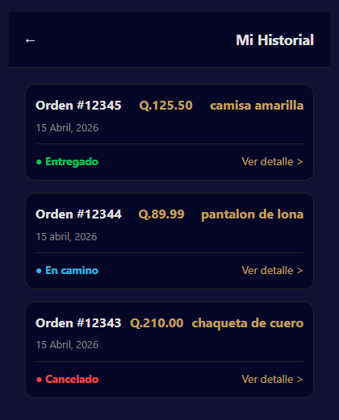
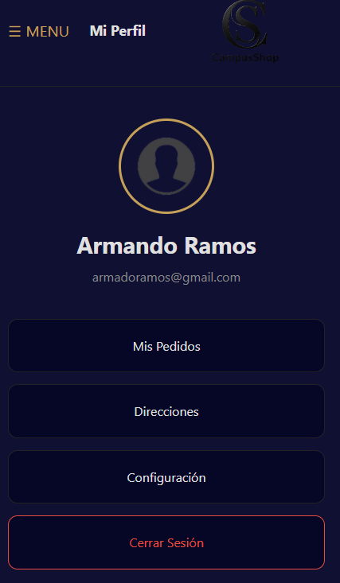
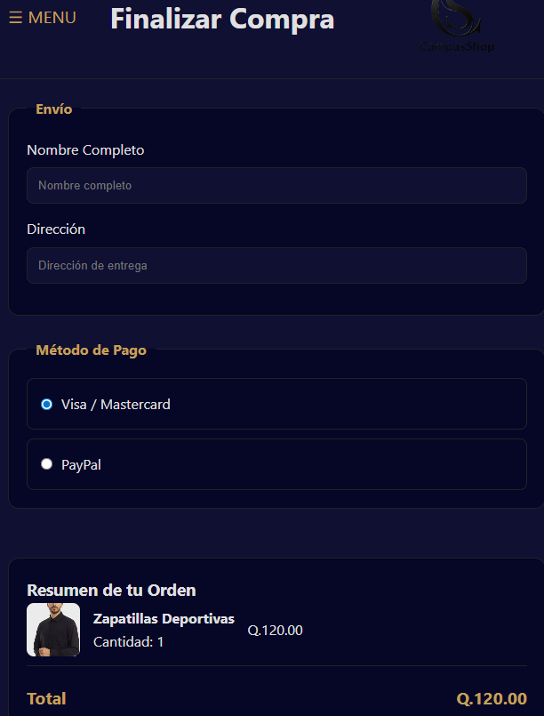

# 🛒 CampusShop - E-commerce Project

Este proyecto consiste en la maquetación profesional de una plataforma de e-commerce completa, desarrollada exclusivamente con **HTML5** y **CSS3**. El enfoque principal es la fidelidad visual estricta al diseño propuesto y una experiencia de usuario fluida y responsiva sin el uso de JavaScript.

## Este es el diagrama de flujo
Este es el diagrama de flujo donde se muestra como y donde lo lleva las opciones, eso si no funciona ningun boton, lo unico que hace es llevarlo a uno a otra pagina y aque no lleva javascrip.
Este diagrama lo hice usando un promt pidiendole a gemini como exactamente tengo la pagina web y que me lo representara en una imagen.

## visualizacion de todas las paginas
home

-menu 

-catalogo

-carrito

-historial

-perfil

-verificar

##  Estructura del Proyecto

El código está organizado de manera semántica para facilitar el mantenimiento y la escalabilidad:

Guía de Navegación

Para explorar todas las funcionalidades maquetadas, sigue este flujo:

Inicio (index.html): Acceso a las categorías principales (Abrigos, Camisas, etc.) y visualización de productos destacados como el "Abrigo Clásico".

Menú Sidebar: Utiliza el Menú Hamburguesa para moverte rápidamente entre el Perfil, el Carrito y el Historial sin perder el contexto, solamente el principal se puede abrir y cerrar sin necesidad de tocar un boton, ya las otras paginas hay que apachar cerrar pagina para que lo haga.

Proceso de Compra: Desde el Carrito, navega hacia la vista de Verificación para completar los datos de envío y ver las opciones de pago (Visa/Paypal)Oviamente sin funcionalidades.

Detalles: Haz clic en "Ver Detalles" en cualquier producto para ver la descripción extendida y el precio en Quetzales (Q).

## Diseño Responsivo y Fidelidad Visual

Se ha implementado una estrategia Mobile-First para asegurar que la interfaz sea funcional en cualquier dispositivo:

Desktop (1024px+): Layout completo con sidebar y grids de productos optimizados.

Tablet (768px): Ajuste de contenedores y escalado de tarjetas de producto.

Mobile (480px): Navegación compacta y elementos apilados para mejorar la legibilidad.

!IMPORTANTE
Fidelidad al Mockup: Cada color, espaciado y componente (como los badges de oferta y el diseño de los botones) ha sido replicado siguiendo estrictamente el diseño base.

## tecnologias usadas

-GitHub

-Git

-VS Code

-HTML

-CSS

## como usarlo
primeramente si es en vscode copiar el codigo y descargar el repositorio.

luego abrirlo en vs code

en index abrirlo con live verse

despues se abre en el navegador pero mucho ojo 

para ver si se ajusta abrirlo en inspeccionar

luego ver las opciones de telefono.

## Autor
Desarrollado por: Sergio Ajú

Año: 2026

